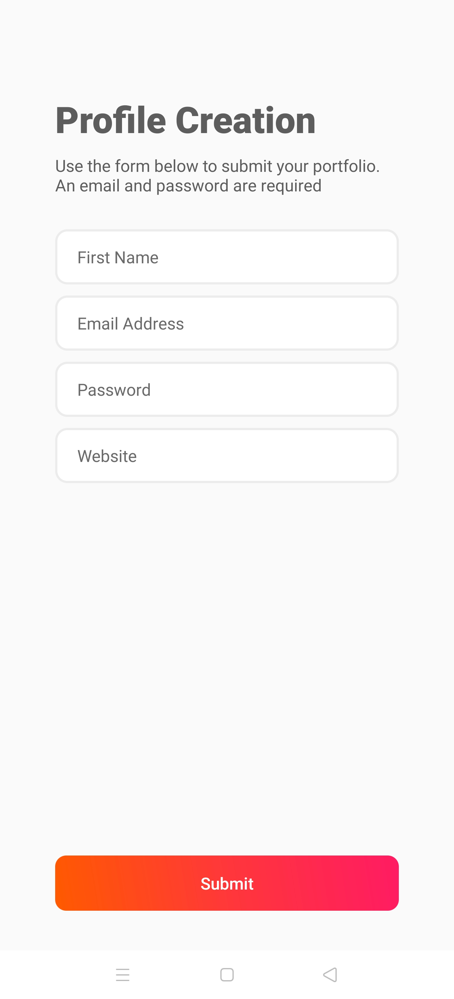
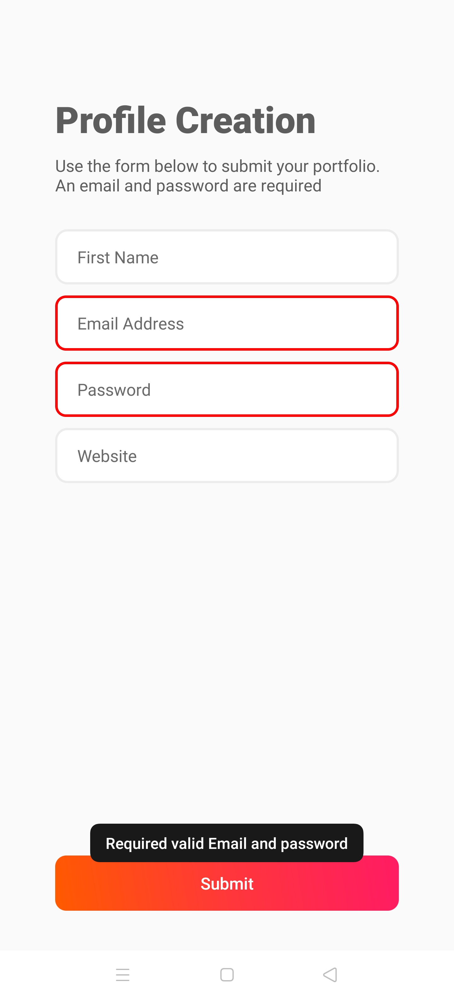
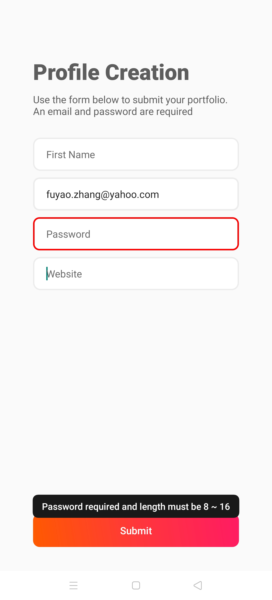
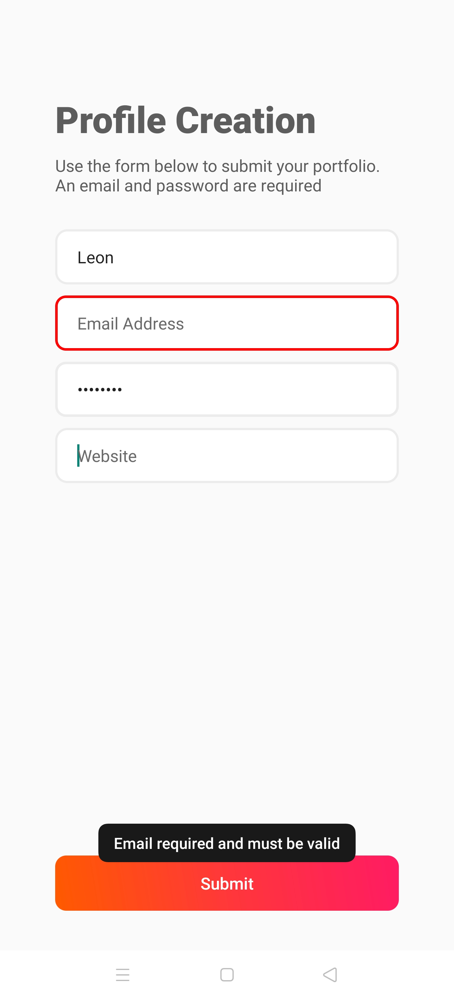
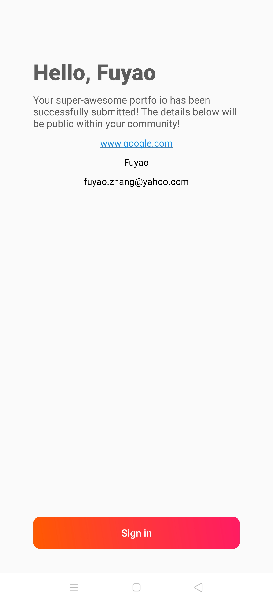
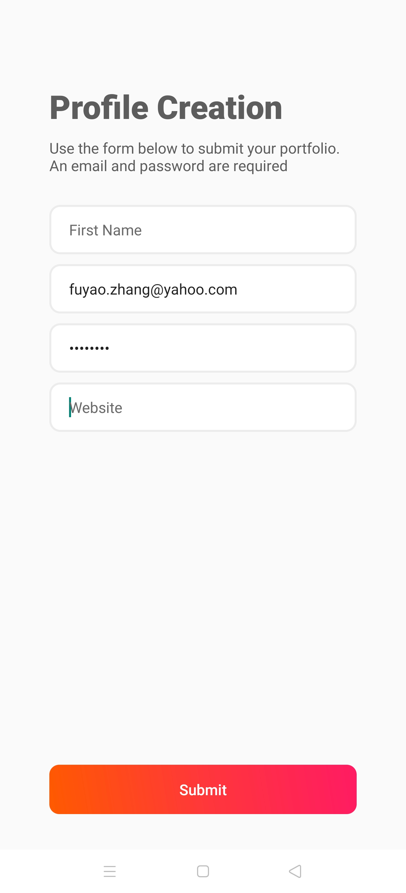
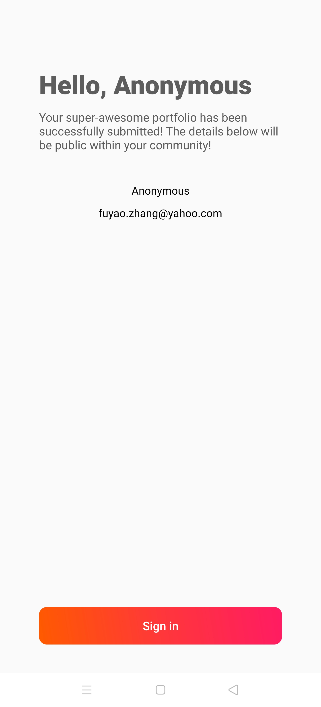

## Fuyao Zhang's The Home Project Demo
### Summary
This Android application adopts the single Activity mode, The login page, and confirmation page are presented by two Fragments respectively. The UI main body of this application realizes self-adaptation through `ConstraintLayout`. The application supports user input data validity check, input data error warming, call browser via user website address, and fragment switching animation.

### SDK version

Android SDK minimum version 29.

### Testing environment

Device: OPPO FindX2 (1440x3168 pixels, ~513 ppi density)

OS version: Android 10

##### MainActivity
- Initialization Fragment
- Declare the overall style of the application
- Monitor user touch events, judge the state of the soft keyboard and hide the soft keyboard.
- Hide the system top bar and navigation bar, swipe up from the bottom of the screen to evoke the navigation bar, which will automatically disappear after 3 seconds.

##### LoginFragment

	

- Construct simple adaptive interfaces.
- User input information verification
	- The first name is not required, but only uppercase and lowercase letters, dots, and spaces are allowed.
	- The email address is required, the input format must conform to the email address format.
	- The password is required and the length must be between 8 to 16. The program uses the Android password input type and will automatically hide the password.
	- The URL is not required.
- Since the soft keyboard covers part of the UI, while the user is using the soft keyboard to input, the user taps the area outside the soft keyboard to automatically close the soft keyboard.
- Submit buttons use gradient colors as required by the project.
- Click the button to verify the validity of the user input information, and if there is an error in the user input information, the corresponding input box will be highlighted, and show a toast to present the error reason. If the user information is valid, forward the user data to ConfirmationFragment via `Bundle` push the current Fragment into the task stack, jump to the ConfirmationFragment at the same time, and display the transition animation.

	
	
	

##### ConfirmationFragment

	

- Load user data from the Bundle
- If the user has not input the first name, the first name present "Anonymous"

	
	

- If the user filled the website address, click the address link to jump to the system browser and visit the user's website.
- Sign in button has no function.
- Press the back button on the navigation bar to pop the previous Fragment with the animation effect. Modify user input data, and resubmit.
